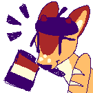

# veadotube mini - traduction française

    

Traduction française non officielle pour le logiciel de marionette virtuelle [veadotube mini](https://veado.tube/).

### ⬇️ Versions

- Pour **veadotube mini version 2.1 et plus**, téléchargez la [version 1.1.0 du pack](https://github.com/Voxybuns/veadotube-mini-fr/releases/tag/v1.1.0)
- Pour **veadotube mini version 2.0a**, téléchargez la [version 1.0.0 du pack](https://github.com/Voxybuns/veadotube-mini-fr/releases/tag/v1.0.0)

### 📜 Instructions d'installation

- Téléchargez la version du pack correspondant à votre version de veadotube (voir section Versions)
- Déposez le .zip (sans le décompresser !) dans le dossier `.veadotube/addons` situé dans votre [répertoire personnel](https://fr.wikipedia.org/wiki/R%C3%A9pertoire_personnel).
- Lancez veadotube mini
- Ouvrez les paramètres du programme en cliquant sur l'icône représentant un curseur dans une fenêtre.
- Sur l'option *language*, cliquez sur les flèches pour sélectionner la traduction française.

### 👥 Crédits
Traduction réalisée par [Voxy](https://voxy.space).

[veadotube mini](https://veado.tube/) est un logiciel créé par [olmewe](https://olmewe.com/) et [BELLA!](https://bellaexclamation.art/)

[Tube The Deer](https://vgen.co/c/tube/mini-tube) est une mascotte créée par [BELLA!](https://bellaexclamation.art/) pour veadotube mini. Modifiée avec permission.